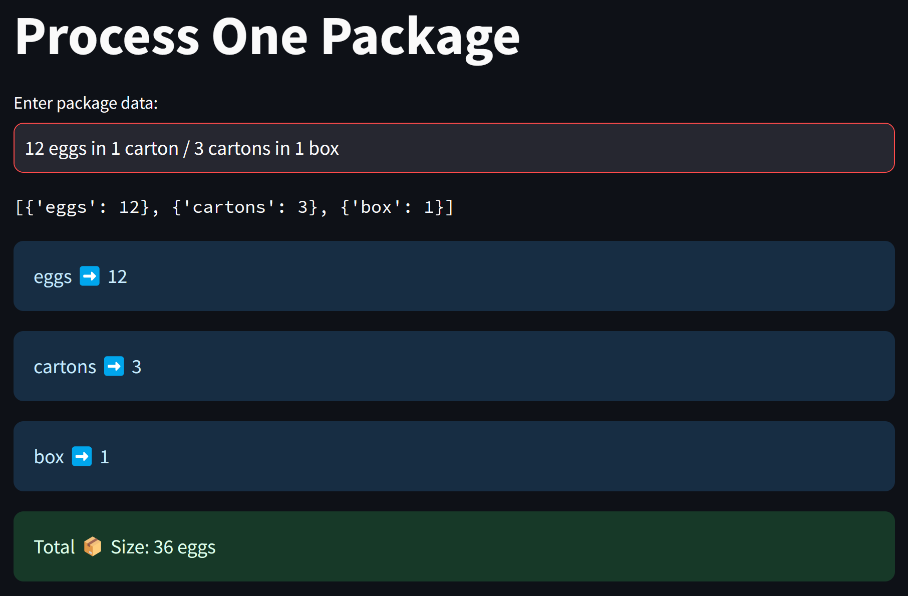
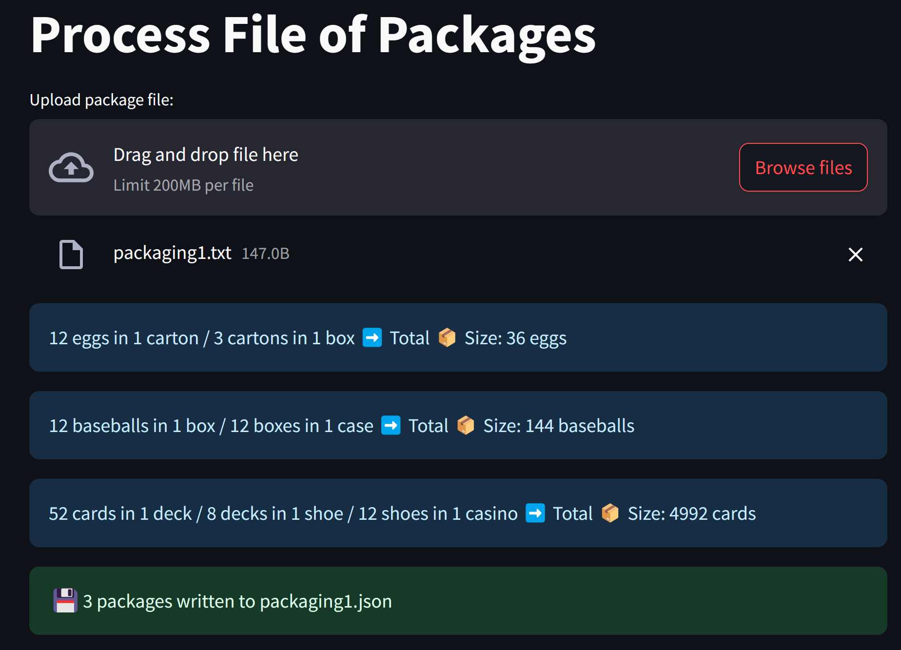
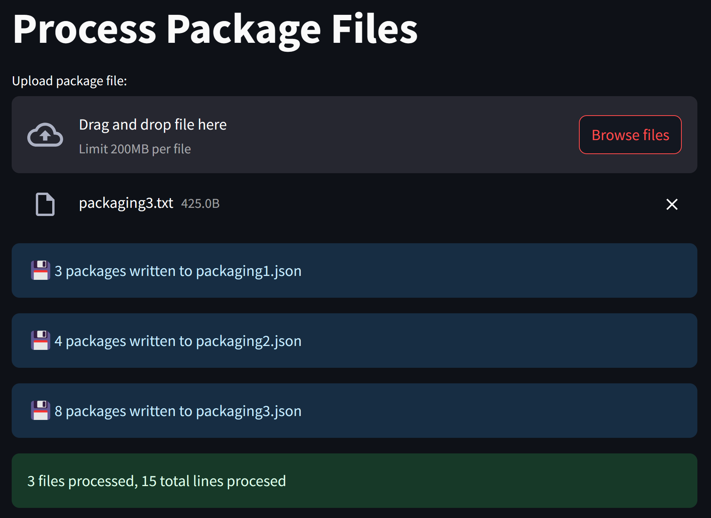

# IST356 Assignment 03 (assignment_03)

## Meta

### Learning Objectives

This assignment will focus on streamlit. You will write three programs, each of which will use the module you created in assignment_02.

### Assignment Folder Layout

The layout of this assignment is similar to Assignment_02. You will not need the tests.

### How to use the solutions

This assignment includes a `solutions` folder. These are there to help you get unstuck. Don't use them unless you absolutely need them. If you do use them I suggest reading the code to understand it and then trying write it yourself. You are not going to get better at Python by copying my solutions. You need to struggle and feel uncomfortable to become a better programmer. This is how you build the deep connections essential to learning any subject.

### Prerequisites 

Before starting this assignment you must install the assignemnt Python requirements:

1. From VS Code, open a terminal: Menu => Terminal => New Terminal
2. In the terminal, type and enter:   
`pip install -r requirements.txt`

## Assignment

### Practicing Code Commits

This assignment has three parts. Perform a code commit (and push if you desire) after you complete each part. You can make more than 3 commits but everyone is expected to have at least 3.

Recall:

- To Commit your changes: VS Code -> menu -> View -> Source Control -> Enter your Commit message -> Click "Commit"
- Push your changes: VS Code -> menu -> View -> Source Control -> Click "Sync Changes"

### Part 1: `one_package.py`

Write a streamlit to input one string of package data. It should use the `packaging.py` module to parse the string and output the package info as it appears. Calculate the total package size then display it. 

**ADVICE:** remember streamit runs on initial load so make sure to only process the package data when it is input.

**COMMIT YOUR CODE AFTER YOU COMPLETE THIS PART**

### Part 2: `process_file.py`

Next, write a streamlit to read one file of packaging information and write out the parsed packaging as a JSON file. The is the same program you wrote in assignment_02 only it uses streamlit. You should output the parsed package and total package size for each package in the file.

**ADVICE:** you will need to convert the uploaded file contents from teh streamlit widget to text and process it a line at a time (see example from class).

**COMMIT YOUR CODE AFTER YOU COMPLETE THIS PART**

### Part 3: `process_files.py`

In this final program, you will re-write your `process_file.py` to keep track of the number of files and total number of lines that have been processed.

For each file you read, you only need to output the summary information eg. "X packages written to file.json".

**ADVICE:** you will need to store the history of files processed, and the totals / counts in the streamlit sessions state.

**COMMIT YOUR CODE AFTER YOU COMPLETE THIS PART**

## Turning it in

- Make sure code runs without errors. In the event your code is not correct. comment out the incorrect code.
- Write your reflection in `reflection.md`
- Commit your changes: VS Code -> menu -> View -> Source Control -> Enter Commit message -> Click "Commit"
- Push your changes: VS Code -> menu -> View -> Source Control -> Click "Sync Changes"

## Grading 

🤖 Beep, Boop. This assignment is bot-graded! When you push your code to GitHub, my graderbot is notified there is something to grade. The bot then takes the following actions:

1. Your assignment repository is cloned from Github
2. The bot checks your code and commits according to guidelines outlined in `assignment-criteria.json` (it runs tests, checking code correctness, etc.)
3. The bot reads your `reflection.md` and provides areas for improvement (based on the instructions in the file).
4. A grade is assigned by the bot. Feedback is generated including justification for the grade given.
5. The grade and feedback are posted to Blackboard.

You are welcome to review the bot's feedback and improve your submission as often as you like.

**NOTE: ** Consider this an experiment in the future of education. The graderbot is an AI teaching assistant. Like a human grader, it will make mistakes. Please feel free to question the bots' feedback! Do not feel as if you should gamify the bot. Talk to me! Like a person, we must teach it how to do its job effectively. 

